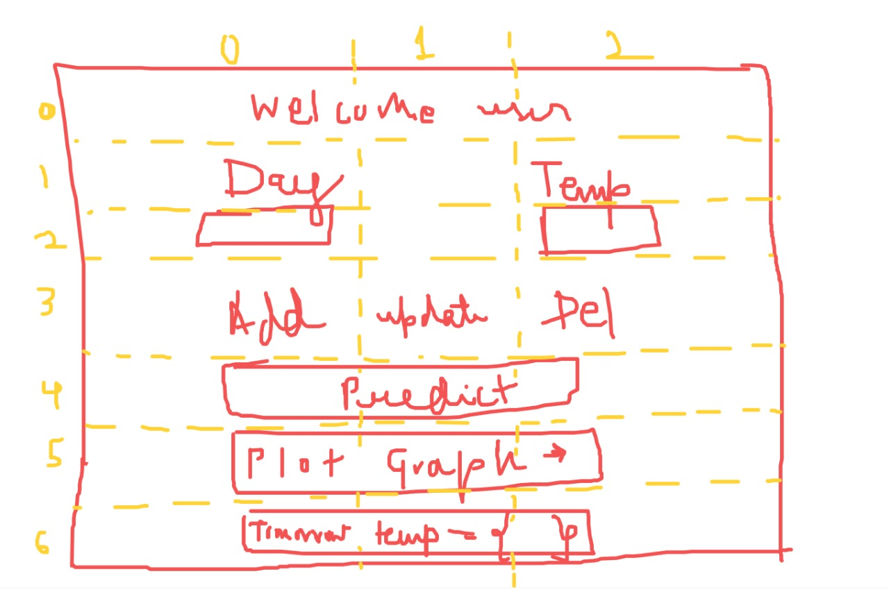

# **Weather Prediction and Data Management System**
# Overview
The Weather Prediction and Data Management System is a simple desktop application built with Python and the Tkinter library. It allows users to perform various tasks related to weather data management, user registration, and weather prediction.

# Features

### User Authentication:

- Users can log in with their username and password.
- If they forget their password, they can recover it by providing their mobile number and email.

### User Registration:

- Users can create new accounts by providing a username, password, mobile number, and email.
- Registration data is stored in an SQLite database.

### Data Management:

- Users can add, update, and delete temperature data for specific days.
- Data is stored in a database for analysis and prediction.

### Weather Prediction:

- The system can predict the temperature for the next day based on the available data.
- Predictions are displayed to the user.

### Data Visualization:

- Users can view temperature data on a line graph using Matplotlib.
- Graphs help users visualize temperature trends.

# Project Structure

- **database.py:** Contains functions for database management, including user registration, data addition, and more.
- **machineLearning.py:** Implements machine learning for temperature prediction.
- **UI.py** The main script for the GUI application.

# Installation
- Make sure you have Python 3.x installed on your system.
- Install required dependencies using: pip install matplotlib scikit-learn
- If you are using IDLE:
-- Copy the project files into the defult python IDLE's location
-- Run UI.py

# Usage
- Run UI.py to start the application.
- Log in or create a new account.
- Manage temperature data, recover a forgotten password, or make predictions.
- Visualize temperature data on a graph.

# Developers words
- The **test.py** file was created for testing the functions of different modules.
- I would like to share a rough sketch of how I designed the UI for this app.

# Contributors
#### *Priyanshu-Batham*